<div align="center">

# 🛡️ SOC-Nemotron-CLI-Linux

### Terminal-Based AI-Assisted Cybersecurity Operations
**Powered by NVIDIA Nemotron 3 Ultra (550B) + OpenCode CLI**

[](#-platform-support)
[](#)
[](https://build.nvidia.com/nvidia/nemotron-3-ultra-550b-a55b)
[](https://opencode.ai/docs/)
[](LICENSE)

</div>

---

<p align="center">
  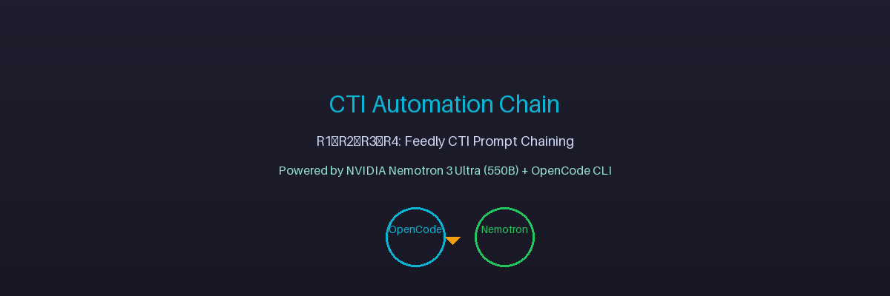
</p>

<p align="center">
  <strong>Terminal-Based AI-Assisted Cybersecurity Operations on Linux</strong><br />
  Powered by <strong>NVIDIA Nemotron 3 Ultra (550B)</strong> + <strong>OpenCode CLI</strong>
</p>

<p align="center">
  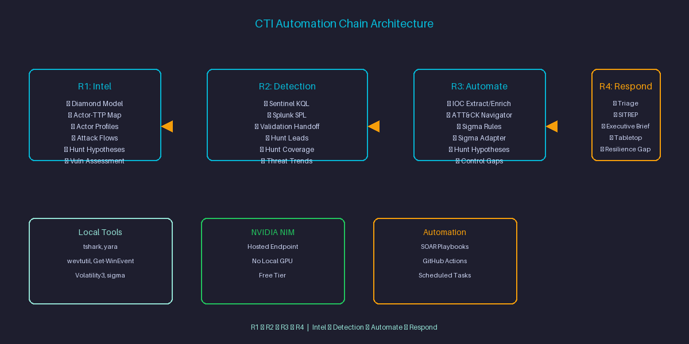
</p>

---

## 📑 Table of Contents

- [Quick Start (5 min)](#-quick-start-5-min)
- [About This Project](#-about-this-project)
- [Why This Stack on Linux](#-why-this-stack-on-linux)
- [Platform Support](#-platform-support)
- [Repository Structure](#-repository-structure)
- [Skill-Level Operational Mapping](#-skill-level-operational-mapping)
- [Setup & Authentication (Linux)](#-setup--authentication-linux)
- [Verify Your Installation](#-verify-your-installation)
- [Prompt Templates (Copy → Edit → Run)](#-prompt-templates-copy--edit--run)
- [Common Mistakes & Fixes (Linux)](#-common-mistakes--fixes-linux)
- [Learning Path (Week-by-Week)](#-learning-path-week-by-week)
- [Example Prompts by Use Case](#-example-prompts-by-use-case)
- [Sample Output (Illustrative)](#-sample-output-illustrative)
- [Rate Limits & Cost Notes](#-rate-limits--cost-notes)
- [Troubleshooting (Linux)](#-troubleshooting-linux)
- [When NOT to Use This Stack](#-when-not-to-use-this-stack)
- [Uninstall / Disconnect](#-uninstall--disconnect)
- [Security & Operational Guidelines](#-security--operational-guidelines)
- [Official Reference Links](#-official-reference-links)
- [Roadmap](#-roadmap)
- [Contributing](#-contributing)
- [Source & Learning Notes](#-source--learning-notes)
- [Author](#-author)
- [License](#-license)

---

## 🚀 Quick Start (5 min)

<p align="center">
  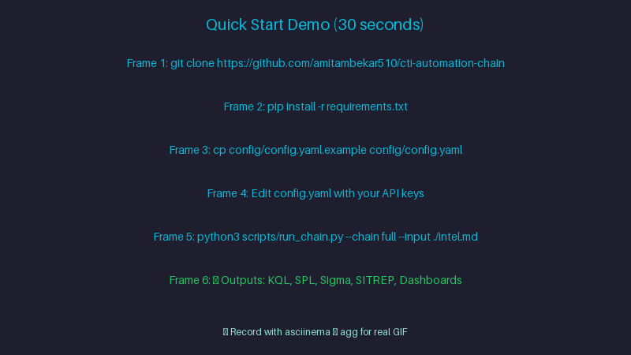
</p>

```bash
# 1. Install Node.js LTS from https://nodejs.org (if not installed)
# Verify:
node -v
npm -v

# 2. Install OpenCode CLI
npm install -g opencode-ai

# 3. Get your NVIDIA API key → https://build.nvidia.com/explore/discover

# 4. Test in 30 seconds
mkdir -p ~/soc-test && cd ~/soc-test
echo "2024-01-15 10:30:45 ERROR Failed login from 192.168.1.100 user=admin" > test.log
opencode "Read test.log, extract the IP, and tell me what to check next"
```

**Expected:** OpenCode reads the log, extracts `192.168.1.100`, and suggests checking `/var/log/auth.log`, `journalctl`, `fail2ban`, and `ufw` logs.

---

## 📖 About This Project

<p align="center">
  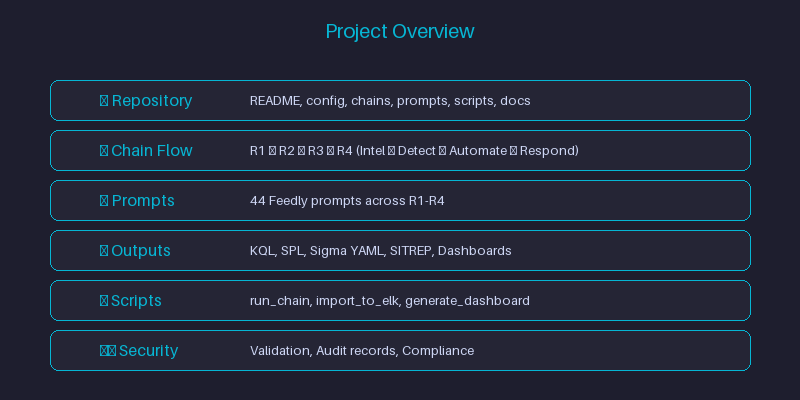
</p>

**SOC-Nemotron-CLI-Linux** is the **Linux edition** of the SOC-Nemotron-CLI project — a hands-on operational guide and prompt library for **Security Operations Center (SOC) Analysts, Threat Hunters, Detection Engineers, and Incident Responders** to leverage **NVIDIA Nemotron 3 Ultra (550B)** — a free, hosted, agentic-reasoning LLM — directly from a **Linux terminal** (bash/zsh/fish) via **OpenCode CLI**.

This repository adapts the original macOS-tested guide for **native Linux environments** — no local GPU required.

⚠️ **Status:** This Linux edition is **community-testing**. The base workflow (OpenCode + Nemotron 3 Ultra) was originally documented and verified on macOS. This edition adapts the same setup and prompt library for native Linux / bash / zsh / fish. Full end-to-end testing on native Linux is in progress — feedback welcome!

---

## 🚀 Why This Stack on Linux

<p align="center">
  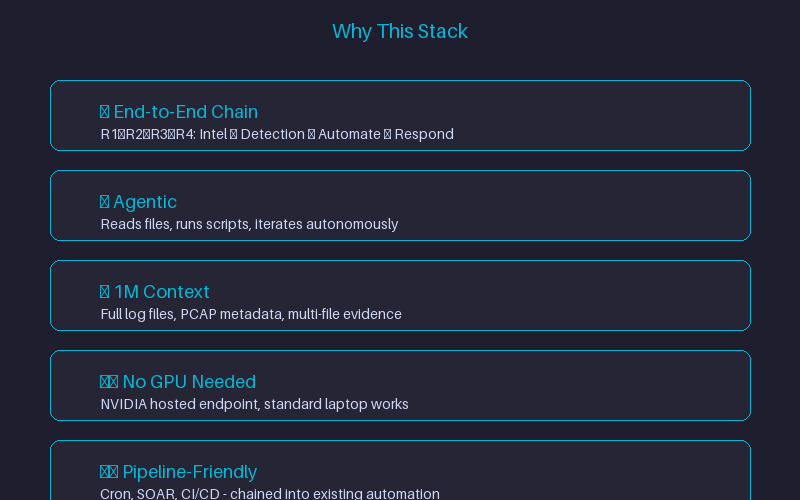
</p>

- **Terminal-native (bash/zsh/fish)** — stays inside the analyst's existing workflow (no browser context-switching mid-investigation)
- **Agentic, not just chat** — OpenCode can read files, run scripts, iterate on errors, write output artifacts autonomously (`--loop` mode)
- **1M-token context** — large enough to ingest full `/var/log` files, EVTX files, PCAP metadata, or multi-file evidence sets
- **No local GPU required** — Nemotron 3 Ultra runs on NVIDIA's hosted endpoint; standard Linux laptop is enough
- **Scriptable & pipeline-friendly** — CLI-based, chains into shell scripts, cron jobs, systemd timers, existing SOC automation

---

## 💻 Platform Support

| Platform | Status |
|----------|--------|
| 🐧 **Linux (this repo)** | 🧪 **Community-testing** — install path verified, feedback welcome |
| 🍎 macOS (original repo) | ✅ Tested & Documented |
| 🪟 Windows | 🧪 Companion repo — see [Roadmap](#-roadmap) |

> **Note:** The underlying CLI and API behavior is identical across platforms. Platform differences are cosmetic (PATH handling, shell config, package manager for local tools). If you test on your Linux distro and hit issues, please report them!

---

## 📁 Repository Structure

```
SOC-Nemotron-CLI-Linux/
├── README.md              → This guide: Linux setup, config, prompts, notes
├── LICENSE                → MIT License
├── config.yaml.example    → Example configuration
├── assets/                → Screenshots, diagrams for documentation
│   ├── hero-banner.png
│   ├── architecture-overview.png
│   ├── quickstart-demo.png
│   ├── project-overview.png
│   ├── why-this-stack.png
│   ├── opencode-tui.png
│   ├── sigma-output.png
│   ├── memory-forensics.png
│   ├── verify-install.png
│   ├── common-mistakes.png
│   ├── learning-path.png
│   ├── when-not-to-use.png
│   ├── nvidia-api-key.png
│   ├── opencode-install.png
│   ├── opencode-tui.png
│   └── quickstart-demo.gif
├── config.yaml.example    → Example configuration
├── chains/                → Chain configurations (R1→R2→R3→R4)
│   ├── r1_intel/
│   ├── r2_detection/
│   ├── r3_automate/
│   └── r4_respond/
├── prompts/               → Feedly CTI Prompt Library (44 prompts)
│   ├── r1/                # R1: Intel Analysis (12 prompts)
│   ├── r2/                # R2: Detection Engineering (14 prompts)
│   ├── r3/                # R3: Workflow Automation (8 prompts)
│   └── r4/                # R4: Response & Reporting (10 prompts)
├── scripts/               → Automation scripts
│   ├── run_chain.py       # Main chain runner
│   ├── run_stage.py       # Single stage runner
│   ├── validate_output.py # Output validator
│   ├── import_to_elk.py   # ELK importer
│   └── generate_dashboard.py # Dashboard generator
├── examples/              → Example inputs
│   └── intel-report.md    # Sample intel report
└── docs/                  → Documentation
    ├── chain_architecture.md
    ├── prompt_reference.md
    ├── customization_guide.md
    └── troubleshooting.md
```

---

## 🎯 Skill-Level Operational Mapping

<p align="center">
  
</p>

| Cybersecurity Role / Level | Primary Terminal Capabilities | Target Use Cases |
|----------------------------|------------------------------|------------------|
| **Tier 1 SOC Analyst (Beginner)** | bash parsing, journalctl normalization, IOC extraction | Parse journalctl/Event IDs, defang IPs/URLs, create iptables/nftables blocklists |
| **Tier 2 Detection Engineer (Intermediate)** | Scripting, query building, automated rule writing | Write & test Sigma/YARA rules, optimize KQL/SPL queries for Sentinel/Splunk |
| **Tier 3 Incident Responder (Expert)** | Shell automation, Volatility3 on Linux, memory forensics | Run iterative volatility loops, triage memory dumps, parse PCAPs on Linux |
| **SOC Lead / Security Manager** | Workflow automation, documentation generation | Generate threat intel briefs, automate client IR reports, shell + SOAR integration |

---

## ⚡ Setup & Authentication (Linux)

### 0. Get Your NVIDIA API Key

<p align="center">
  
</p>

1. Open the [NVIDIA Nemotron 3 Ultra model page](https://build.nvidia.com/nvidia/nemotron-3-ultra-550b-a55b) and sign in / create a free NVIDIA account
2. Click **Generate API Key**
3. Copy the key — it looks like `nvapi-xxxxxxxxxxxxxxxx`

⚠️ **Never share your API key publicly or commit it to source control.**

### 1. Install OpenCode CLI

<p align="center">
  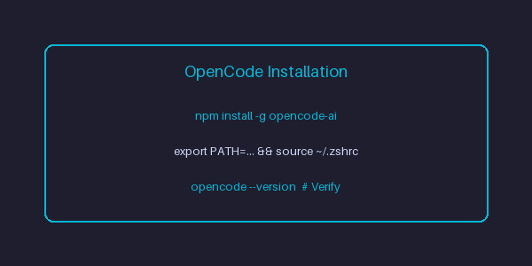
</p>

OpenCode CLI requires **Node.js LTS**. If you don't have it:

1. Download and install **Node.js LTS for Linux** from [nodejs.org](https://nodejs.org)
2. Verify in bash:
```bash
node -v
npm -v
```

### 2. Install OpenCode CLI

Open **bash** (or your preferred shell) and run:
```bash
npm install -g opencode-ai
```
> **Note:** The Unix-style `curl | bash` installer used on macOS/Linux works too:
> ```bash
> curl -fsSL https://opencode.ai/install | bash
> ```

See the official [OpenCode documentation](https://opencode.ai) for details.

### 3. Add OpenCode to Your PATH

`npm install -g` normally adds OpenCode to your PATH automatically. If bash doesn't recognize the command:

```bash
# Find where npm installs global packages
npm config get prefix

# Add that path to your PATH via:
# ~/.bashrc (or ~/.zshrc / ~/.config/fish/config.fish)
# Or temporarily for current session:
export PATH=$PATH:$(npm config get prefix)/bin
```

Restart your shell after updating PATH permanently.

### 3. Launch OpenCode and Connect to NVIDIA NIM

<p align="center">
  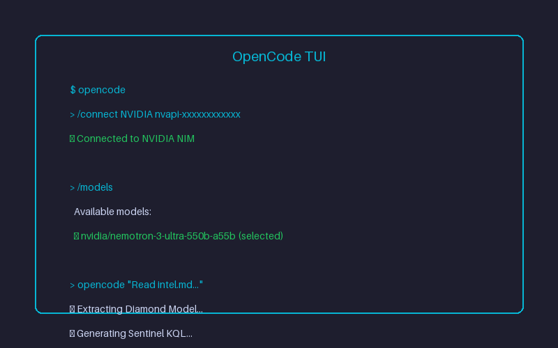
</p>

```bash
# Navigate to your investigation / log directory
cd ~/soc-investigations

# Launch OpenCode TUI
opencode

# Authenticate and select Nemotron 3 Ultra
/connect NVIDIA nvapi-YOUR_NVIDIA_API_KEY
/models  # Select: nvidia/nemotron-3-ultra-550b-a55b
```

### 4. Provider Configuration

Add to your OpenCode config (typically `~/.config/opencode/opencode.json`):
```json
{
  "$schema": "https://opencode.ai/config.json",
  "provider": {
    "nvidia": {
      "npm": "@ai-sdk/openai-compatible",
      "name": "NVIDIA NIM",
      "options": {
        "baseURL": "https://integrate.api.nvidia.com/v1",
        "apiKey": "nvapi-YOUR_NVIDIA_API_KEY"
      },
      "models": {
        "nvidia/nemotron-3-ultra-550b-a55b": {
          "name": "Nemotron 3 Ultra (550B)",
          "limit": {
            "context": 1000000,
            "output": 16384
          }
        }
      }
    }
  }
}
```

Replace `nvapi-YOUR_NVIDIA_API_KEY` with your actual NVIDIA NIM API key. **Never commit real keys to source control** — use environment variables or a secrets manager instead.

### Model Specs at a Glance

| Attribute | Detail |
|-----------|--------|
| **Model ID** | `nvidia/nemotron-3-ultra-550b-a55b` |
| **API Endpoint** | `https://integrate.api.nvidia.com/v1` |
| **Context Window** | Up to 1,000,000 tokens |
| **Total Parameters** | ~550B (NVIDIA lists 561B in endpoint specs) |
| **Active Parameters** | ~55B (MoE-style architecture) |
| **Use Cases** | Agentic reasoning, coding, planning, tool calling, long-context tasks |

---

## ✅ Verify Your Installation

<p align="center">
  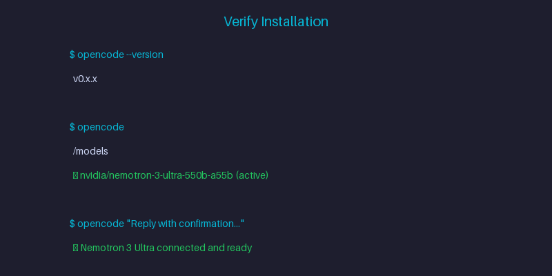
</p>

```bash
# Confirm OpenCode is installed and on PATH
opencode --version

# Confirm the NVIDIA provider is connected and the model is selected
opencode
/models   # nvidia/nemotron-3-ultra-550b-a55b should show as active

# Run a quick smoke-test prompt
opencode "Reply with a one-line confirmation that Nemotron 3 Ultra is connected and ready."
```

If the model responds, your setup is complete and you're ready to move on to the SOC use cases below.

---

## 📋 Prompt Templates (Copy → Edit → Run)

Copy a template, replace the `{{PLACEHOLDERS}}`, and run in bash.

### Linux Log IOC Extraction & Firewall Blocklist
```bash
opencode "Read {{LOG_FILE}}, extract all {{IOC_TYPE}} (IPv4 addresses, domains, SHA256 hashes, emails), defang them (e.g., 192.168.1[.]1, example[.]com), and structure into {{OUTPUT_FILE}}.json with fields: type, value, source, confidence, tags."
```

### Sigma Detection Rule Authoring (Linux Logs)
```bash
opencode "Analyze {{LOG_FILE}} and generate a valid Sigma detection rule targeting {{ATTACK_TECHNIQUE}} with MITRE ATT&CK mapping. Focus on Linux log sources (journalctl, auditd, auditd). Include detection logic, false positive considerations, and test cases."
```

### Log Parsing Script Generator (bash/Python)
```bash
opencode "Write a {{LANG}} script to parse {{LOG_FORMAT}} logs (journalctl, auditd, syslog), extract {{FIELD_LIST}}, and output CSV. Handle {{EDGE_CASES}}. Save as parse_{{LOG_TYPE}}.sh"
```

### PCAP Metadata Extraction (Linux Tools)
```bash
opencode "Read {{PCAP_FILE}}, extract conversation summary, top talkers, DNS queries, HTTP hosts/URLs, TLS SNI, and suspicious patterns. Use Linux-compatible tools (tshark, Zeek, tcpdump). Output summary as {{OUTPUT_FILE}}.md"
```

### Memory Forensics Triage Script (Volatility3 on Linux)
```bash
opencode --loop "Write a Python script using Volatility3 to parse {{MEMORY_DUMP}} for {{ARTIFACT_TYPE}} (processes, network connections, injected code, loaded kernel modules). Handle Linux-specific issues (kernel symbol tables, profile detection). Output markdown triage report."
```

### Phishing Email Header Analysis
```bash
opencode "Read {{EML_FILE}}, parse all headers, extract sender IP path, SPF/DKIM/DMARC results, authentication results, message IDs, hop delays, and identify anomalies. Output as {{OUTPUT_FILE}}.json with fields: headers_parsed, spf_result, dkim_result, dmarc_result, ip_path, anomalies, risk_score."
```

### Linux Auditd Threat Hunting
```bash
opencode "Read {{AUDIT_LOG}}, hunt for {{MITRE_TECHNIQUE}} (e.g., T1059.004, T1003.008, T1003.008). Correlate auditd events (execve, openat, connect). Output findings with MITRE mapping and timeline."
```

---

## ❌ Common Mistakes & Fixes (Linux)

<p align="center">
  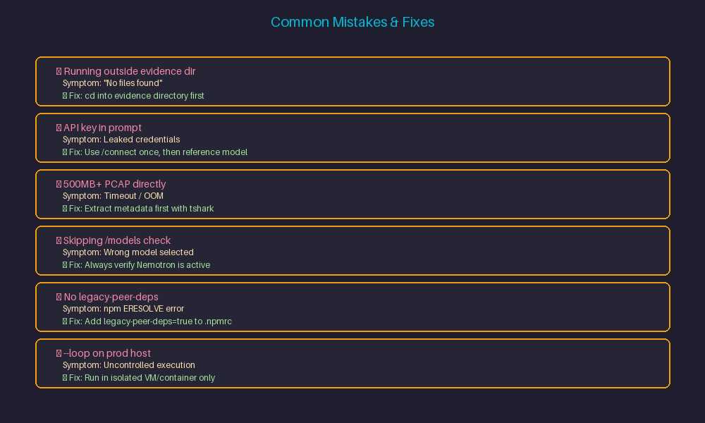
</p>

| Mistake | Symptom | Fix |
|---------|---------|-----|
| Running `opencode` outside evidence directory | "No files found" / empty context | `cd` into the directory containing log files before starting `opencode` |
| Using real API key directly in prompt | Leaked credentials in history | Use `/connect` once, then reference model by name |
| Passing 500MB+ PCAP/journalctl directly to prompt | Timeout / OOM / truncated context | Extract metadata first: `journalctl -o json > logs.json` then pass `logs.json` |
| Skipping `/models` check after connect | Wrong model selected (default chat model) | Always run `/models` and verify `nvidia/nemotron-3-ultra-550b-a55b` is active |
| No `legacy-peer-deps` in `.npmrc` | `npm install` fails with ERESOLVE | Add `legacy-peer-deps=true` to `.npmrc` (see repo `.npmrc`) |
| Running `--loop` on production host | Uncontrolled script execution | Run loops in isolated VM/container only (Podman/Docker/VM) |
| Passing sensitive logs without redaction | Credentials/API keys sent to AI | Scrub secrets (API keys, passwords, tokens) from logs before prompting |
| npm EACCES permission errors | npm global folder not user-writable | `npm config set prefix "$HOME/.npm-global"` or use `npx` |

---

## 🎓 Learning Path (Week-by-Week)

<p align="center">
  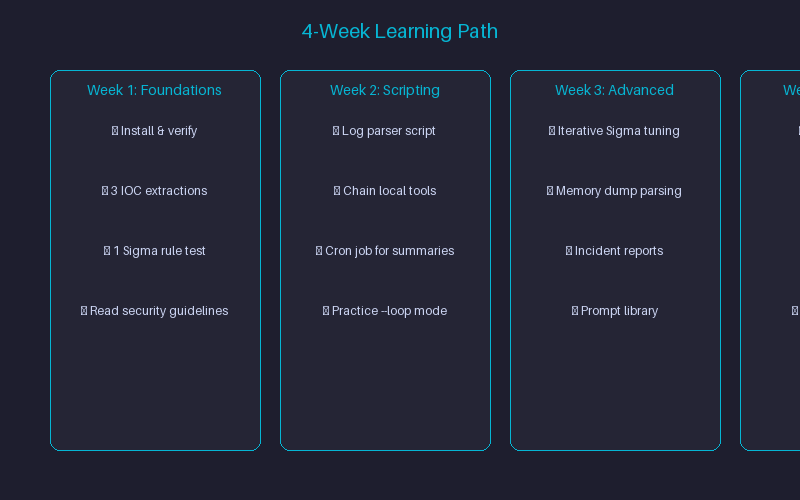
</p>

### **Week 1: Foundations (Linux)**
- [ ] Install Node.js LTS, verify `node -v` / `npm -v`
- [ ] Install OpenCode CLI via `npm install -g opencode-ai`
- [ ] Configure PATH if needed (`npm config get prefix` → add to PATH)
- [ ] Get NVIDIA API key, connect (`/connect NVIDIA nvapi-...`)
- [ ] Verify `/models` shows Nemotron 3 Ultra
- [ ] Run 3 IOC extraction prompts on sample Linux logs
- [ ] Generate 1 Sigma rule for Linux logs, test in local SIEM

### **Week 2: Scripting & Automation (bash/Python)**
- [ ] Write a journalctl/auditd log parser script via prompt template
- [ ] Chain opencode with Linux tools (`jq`, `yara`, `tshark`, `volatility3`, `auditd`)
- [ ] Build a systemd timer or cron job for daily log summary email
- [ ] Practice `--loop` mode on a safe test case

### **Week 3: Advanced Workflows (Linux Forensics)**
- [ ] Use `--loop` for iterative Sigma rule tuning (generate → test → refine)
- [ ] Parse memory dump with Volatility3 via opencode `--loop` on Linux
- [ ] Generate client-ready incident report from raw Linux evidence
- [ ] Build a reusable prompt library for your team

### **Week 4: Integration & Operationalization (Linux Ecosystem)**
- [ ] Wrap a workflow in SOAR playbook (Cortex XSOAR, Splunk SOAR, Tines, custom shell)
- [ ] Add to CI/CD for detection rule validation (GitHub Actions, GitLab CI)
- [ ] Document team runbook with approved Linux-specific prompts
- [ ] Set up systemd timers for daily/weekly triage jobs

---

## 🧰 Example Prompts by Use Case (Linux-Focused)

### Linux Log IOC Extraction & Firewall Blocklist
```bash
opencode "Read {{LOG_FILE}}, extract all {{IOC_TYPE}} (IPv4 addresses, domains, SHA256 hashes, emails), defang them (e.g., 192.168.1[.]1, example[.]com), and structure into {{OUTPUT_FILE}}.json with fields: type, value, source, confidence, tags. Generate iptables/nftables commands to block malicious IPs."
```

### Sigma Detection Rule Authoring (Linux Log Focus)
```bash
opencode "Analyze {{LOG_FILE}} and generate a valid Sigma detection rule targeting {{ATTACK_TECHNIQUE}} with MITRE ATT&CK mapping. Focus on Linux log sources (journalctl, auditd, syslog). Include detection logic, false positive considerations, and test cases."
```

### Log Parsing Script Generator (bash/Python)
```bash
opencode "Write a bash/Python script to parse {{LOG_FORMAT}} logs (journalctl, auditd, syslog), extract {{FIELD_LIST}}, and output CSV. Handle {{EDGE_CASES}}. Save as parse_{{LOG_TYPE}}.sh"
```

### PCAP Metadata Extraction (Linux Tools)
```bash
opencode "Read {{PCAP_FILE}}, extract conversation summary, top talkers, DNS queries, HTTP hosts/URLs, TLS SNI, and suspicious patterns. Use Linux-compatible tools (tshark, Zeek, tcpdump). Output summary as {{OUTPUT_FILE}}.md"
```

### Memory Forensics Triage Script (Volatility3 on Linux)
```bash
opencode --loop "Write a Python script using Volatility3 to parse {{MEMORY_DUMP}} for {{ARTIFACT_TYPE}} (processes, network connections, injected code, loaded kernel modules, kernel modules). Handle Linux-specific issues (kernel symbol tables, profile detection). Output markdown triage report."
```

### Phishing Email Header Analysis
```bash
opencode "Read {{EML_FILE}}, parse all headers, extract sender IP path, SPF/DKIM/DMARC results, authentication results, message IDs, hop delays, and identify anomalies. Output as {{OUTPUT_FILE}}.json with fields: headers_parsed, spf_result, dkim_result, dmarc_result, ip_path, anomalies, risk_score."
```

### Linux Auditd Threat Hunting
```bash
opencode "Read {{AUDIT_LOG}}, hunt for {{MITRE_TECHNIQUE}} (e.g., T1059.004, T1003.008, T1003.008). Correlate auditd events (execve, openat, connect). Output findings with MITRE mapping and timeline."
```

---

## 🖥️ Sample Output (Illustrative)

<p align="center">
  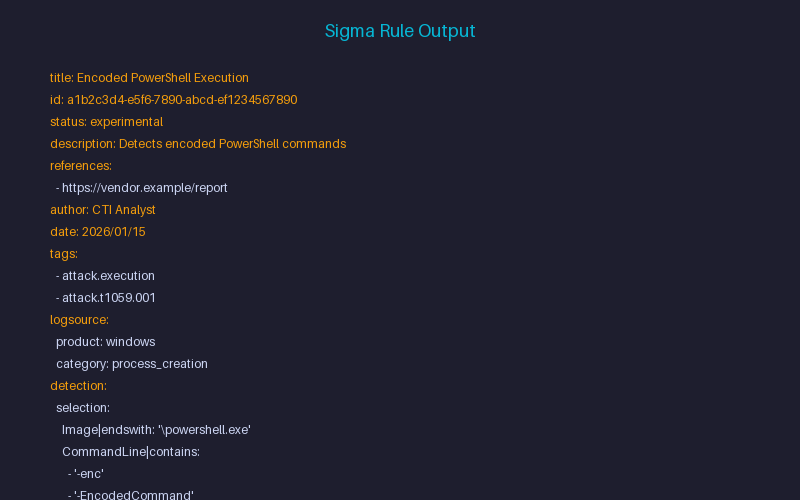
</p>

To show the shape of what Nemotron 3 Ultra returns, here's an illustrative (redacted/simplified) example for the **Sigma Detection Rule Authoring** prompt above:

```yaml
title: Suspicious Bash Process Execution
id: a1b2c3d4-linux-example
status: experimental
description: Detects encoded/obfuscated bash command-line patterns commonly used to evade logging.
logsource:
  category: process_creation
  product: linux
detection:
  selection:
    Image|endswith: '/bash'
    CommandLine|contains:
      - 'base64 -d'
      - 'eval'
      - 'exec'
      - '$(curl'
      - '$(wget'
  condition: selection
level: high
tags:
  - attack.execution
  - attack.t1059.004
```

⚠️ **This is a simplified, illustrative example to show output format — not a production-validated rule.** Always run generated Sigma/YARA rules and firewall entries through analyst review before deployment (see [Security & Operational Guidelines](#-security--operational-guidelines)).

---

## 💰 Rate Limits & Cost Notes

- NVIDIA's hosted endpoint for Nemotron 3 Ultra is currently offered under a free trial/API tier — exact request-per-minute and token quotas are set by NVIDIA and subject to change without notice.
- Check current limits on your [NVIDIA build.nvidia.com](https://build.nvidia.com) account dashboard before relying on it for time-sensitive IR work.
- For high-volume or production SOC use, plan for the possibility of moving to a paid tier or self-hosted inference in the future.

---

## 🧩 Troubleshooting (Linux)

| Issue | Technical Cause | Operational Fix |
|-------|-----------------|-----------------|
| `bash: opencode: command not found` | Terminal PATH missing OpenCode directory | Run `echo 'export PATH=$HOME/.opencode/bin:$PATH' >> ~/.bashrc && source ~/.bashrc` |
| `"Not Found" Error` / empty context | OpenCode launched outside evidence directory | `cd` directly into the incident directory containing log files before starting `opencode` |
| Execution Timeout on PCAPs | Sub-shell missing local security tool binaries | Ensure local tools (`tshark`, `yara`, `volatility3`) are installed and in system `$PATH` |
| `npm install -g` fails with `EACCES` | npm's default global folder isn't user-writable | Run `npm config set prefix "$HOME/.npm-global"` then add to PATH, or use `npx` |
| `npm install -g` fails with `ERESOLVE` | React 19 peer dependency conflict | Add `legacy-peer-deps=true` to `.npmrc` |
| `opencode` runs but no output | Not in evidence directory | `cd` into directory with logs before starting `opencode` |
| Passing 500MB+ journalctl/PCAP directly | Timeout / OOM / truncated context | Extract metadata first: `journalctl -o json > logs.json` |
| Skipping `/models` check | Wrong model selected | Always run `/models` and verify `nvidia/nemotron-3-ultra-550b-a55b` is active |
| `npm install -g` fails with ERESOLVE | React 19 peer dependency conflict | Add `legacy-peer-deps=true` to `.npmrc` |
| `--loop` on production host | Uncontrolled script execution | Run loops in isolated Podman/VM/Docker only |
| Passing sensitive logs without redaction | Credentials/API keys sent to AI | Scrub secrets (API keys, passwords, tokens) from logs before prompting |
| Path issues with spaces | bash escape issues | Use quotes `"/path/with spaces"` or escape `\/path\/with\ spaces` |

---

## 🚫 When NOT to Use This Stack

<p align="center">
  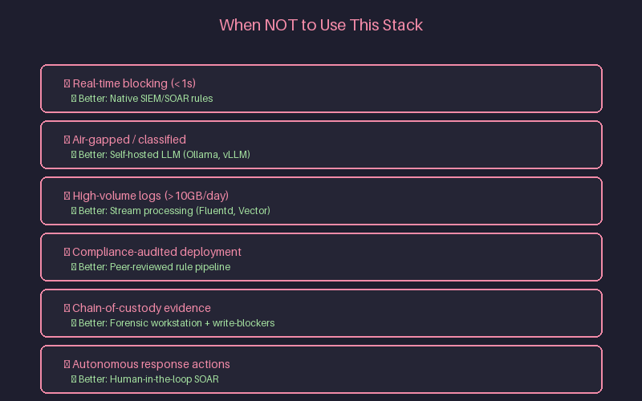
</p>

| Scenario | Better Alternative |
|----------|-------------------|
| Real-time blocking (sub-second latency required) | Native systemd / Falco / eBPF rules |
| Classified / air-gapped environments | Self-hosted LLM (Ollama, vLLM, llama.cpp on Linux) |
| High-volume log processing (>10 GB/day) | Stream processing (Fluentd, Vector, Cribl, Fluent Bit) |
| Compliance-audited rule deployment | Peer-reviewed rule pipeline with CI/CD validation |
| Evidence requiring chain-of-custody | Forensic workstation with write-blockers |
| Autonomous response (block, quarantine) | Human-in-the-loop SOAR playbook |

---

## ⚡ Setup & Authentication (Linux) — Quick Reference

### 0. Get NVIDIA API Key
1. Open [NVIDIA Nemotron 3 Ultra](https://build.nvidia.com/nvidia/nemotron-3-ultra-550b-a55b) → sign in → **Generate API Key**
2. Copy key (`nvapi-xxxxxxxxxxxxxxxx`)

### 1. Install Node.js + OpenCode
```bash
# Install Node.js LTS from nodejs.org first
npm install -g opencode-ai
# Add to PATH if needed: export PATH=$PATH:$(npm config get prefix)/bin
```

### 2. Connect & Configure
```bash
cd ~/soc-investigations
opencode
/connect NVIDIA nvapi-YOUR_KEY
/models  # Select: nvidia/nemotron-3-ultra-550b-a55b
```

### 3. Provider Config
Create `~/.config/opencode/opencode.json`:
```json
{
  "$schema": "https://opencode.ai/config.json",
  "provider": {
    "nvidia": {
      "npm": "@ai-sdk/openai-compatible",
      "name": "NVIDIA NIM",
      "options": {
        "baseURL": "https://integrate.api.nvidia.com/v1",
        "apiKey": "nvapi-YOUR_NVIDIA_API_KEY"
      },
      "models": {
        "nvidia/nemotron-3-ultra-550b-a55b": {
          "name": "Nemotron 3 Ultra (550B)",
          "limit": { "context": 1000000, "output": 16384 }
        }
      }
    }
  }
}
```

---

## ✅ Verify Your Installation

<p align="center">
  
</p>

```bash
opencode --version
opencode
/models   # Verify: nvidia/nemotron-3-ultra-550b-a55b
opencode "Reply with a one-line confirmation that Nemotron 3 Ultra is connected and ready."
```

---

## 🗑️ Uninstall / Disconnect

```bash
# Remove OpenCode CLI
npm uninstall -g opencode-ai
# Remove PATH line from ~/.bashrc (or ~/.zshrc), then:
source ~/.bashrc

# Revoke NVIDIA API key
# → build.nvidia.com → API Keys → Delete
```

---

## ⚠️ Security & Operational Guidelines

- **Redact Sensitive Data** — Always scrub production credentials, API secrets, and sensitive PII from logs before passing to AI prompts.
- **Isolate Environments** — Run autonomous loops (`--loop`) inside isolated staging VMs or containers (Podman, Docker, VMs) when interacting with suspicious files.
- **Analyst Verification** — Always manually inspect generated firewall rules and SIEM correlation queries prior to pushing to production environments.
- **No Autonomous Response** — Never let AI directly block, quarantine, or modify production systems without human approval.
- **Linux-Specific** — Use `iptables`/`nftables`/`ufw` native APIs for response actions; prefer `systemd` timers over cron.

---

## 🔗 Official Reference Links

- [NVIDIA Nemotron 3 Ultra — Model Page](https://build.nvidia.com/nvidia/nemotron-3-ultra-550b-a55b)
- [NVIDIA Nemotron 3 Ultra — Model Card](https://build.nvidia.com/nvidia/nemotron-3-ultra-550b-a55b/modelcard)
- [OpenCode Documentation](https://opencode.ai)
- [OpenCode NVIDIA Provider Guide](https://opencode.ai/docs/providers/nvidia)
- [Node.js for Linux](https://nodejs.org/en/download/)
- [Linux Auditd Documentation](https://linux-audit.github.io/auditd/)
- [Volatility3 Documentation](https://volatility3.readthedocs.io/)

---

## 🗺️ Roadmap

- [x] macOS setup guide, config, and prompt library ([original repo](https://github.com/amitambekar510))
- [x] Windows setup guide (companion repo, published separately)
- [x] Linux setup guide (this repo — npm install path verified)
- [ ] Full end-to-end NVIDIA connection flow verified live on Linux
- [ ] Additional Linux-specific SOC/IR prompt examples
- [ ] `examples/` folder with ready-to-run configs and prompt files
- [ ] Reference shell scripts (journalctl parsers, Sigma generators, Volatility wrappers)

---

## 🤝 Contributing

This is a personal study/reference repo, and the **Linux edition is community-testing**. If you run this on a real Linux machine and find something that needs correcting, please open an issue/PR — or reach out directly (see Author).

### 📝 Submit a Prompt Template

```markdown
**Use Case:** [e.g., Linux kernel module analysis]
**Skill Level:** [Beginner / Intermediate / Expert]
**Prompt:**
```
opencode "Your prompt here with {{PLACEHOLDERS}}"
```

**Sample Input:** [paste or describe]
**Expected Output:** [describe]
**Tools Required:** [local binaries, APIs]
**Validation Steps:** [how to verify output]
```

**PR Title:** `prompt: add [use-case] template`

---

## 📝 Source & Learning Notes

This repo adapts the original macOS-tested SOC-Nemotron-CLI guide for native Linux environments, as part of ongoing self-study into emerging AI capabilities relevant to security operations. It combines setup steps, configuration, and cybersecurity-specific example prompts adapted for bash/Linux — currently scoped to Linux community-testing, with full end-to-end flow verification planned.

⚠️ **Disclaimer:** NVIDIA's hosted endpoint is currently offered for free, but availability, quotas, and trial terms are subject to change and governed by NVIDIA's API Trial Terms and the model's license. This guide is for educational and informational purposes only — no outcome is guaranteed. NVIDIA, Nemotron, OpenCode, and other product names are trademarks of their respective owners.

---

## 👤 Author

**Amit Ambekar**  
🔗 GitHub — [@amitambekar510](https://github.com/amitambekar510)  
🔗 LinkedIn — [Amit Milind Ambekar](https://linkedin.com/in/amitmilindambekar/)  
Exploring emerging AI tooling for cybersecurity operations. Spotted something that needs fixing on your Linux setup, or have a better approach? Connect on LinkedIn and let's discuss.

---

## 📜 License

MIT License — see [LICENSE](LICENSE) for details.

---

## 📸 Assets Included

All images are in the `assets/` folder and referenced in this README:

| Image | Purpose |
|-------|---------|
| `hero-banner.png` | Hero banner |
| `architecture-overview.png` | R1→R2→R3→R4 chain architecture |
| `quickstart-demo.png` | 30-second demo frames |
| `project-overview.png` | Project overview infographic |
| `why-this-stack.png` | 5 reasons visual |
| `opencode-tui.png` | OpenCode TUI screenshot |
| `sigma-output.png` | Sample Sigma rule output |
| `memory-forensics.png` | Memory forensics (--loop) |
| `verify-install.png` | Verification steps |
| `common-mistakes.png` | Visual mistakes guide |
| `learning-path.png` | 4-week learning path |
| `when-not-to-use.png` | When not to use visual |
| `nvidia-api-key.png` | NVIDIA API key generation |
| `opencode-install.png` | OpenCode installation |
| `opencode-tui.png` | OpenCode TUI (Windows) |
| `verify-install.png` | Verify install |
| `quickstart-demo.gif` | Animated demo placeholder |

---

## 🙏 Acknowledgments

- [NVIDIA](https://www.nvidia.com/) for Nemotron 3 Ultra
- [OpenCode](https://opencode.ai/) for the agentic CLI
- [Feedly](https://feedly.com) for the CTI Prompt Library
- Security community for inspiration and feedback
- Linux security community for journalctl/auditd/Volatility3 expertise